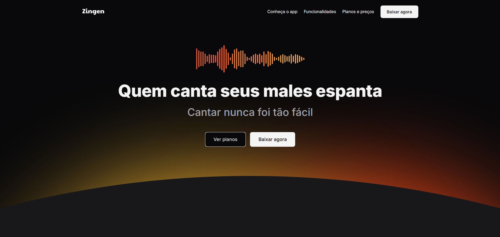

# Zingen - Karaokê

Bem-vindo ao **Zingen**, o aplicativo perfeito para aprender a cantar, se divertir e evoluir no karaokê! 🎤✨

## Sobre o Projeto

O Zingen utiliza Inteligência Artificial para remover a voz original das músicas, permitindo que você cante com as melodias originais. O app também avalia sua performance e afinação, ajudando você a melhorar cada vez mais.

## Funcionalidades

- 🎵 **Biblioteca ilimitada:** Cante qualquer música, nossa IA remove a voz original!
- 🏆 **Experiência gamificada:** Ganhe pontos, desafie-se e acompanhe sua evolução.
- 🎤 **Gravação de áudio e vídeo:** Grave suas performances para compartilhar ou acompanhar seu progresso.
- 👨‍👩‍👧‍👦 **Planos para todos:** Gratuito, Premium e Família.

## Layout

O projeto utiliza HTML e CSS puro, com design responsivo e moderno.



## Estrutura de Pastas

```
index.html
assets/
styles/
```

- **assets/**: Imagens, ícones e recursos visuais.
- **styles/**: Folhas de estilo CSS organizadas por seção.

## Como Visualizar

1. Clone este repositório:
   ```sh
   git clone https://github.com/malopez23/zingen.git
   ```
2. Abra o arquivo `index.html` em seu navegador.

## Créditos

Desenvolvido por Zingen Technologies, Inc.  
Design inspirado em tendências modernas de UI/UX.

---

©2024 Zingen Technologies, Inc.